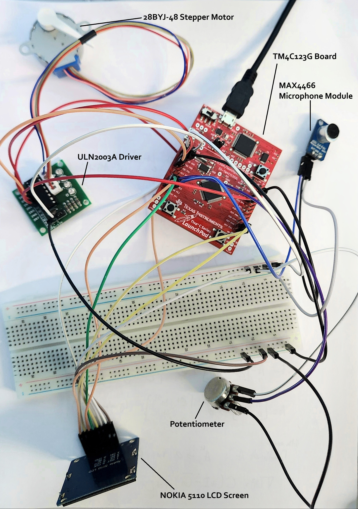
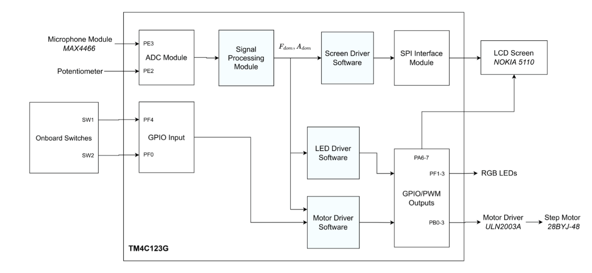
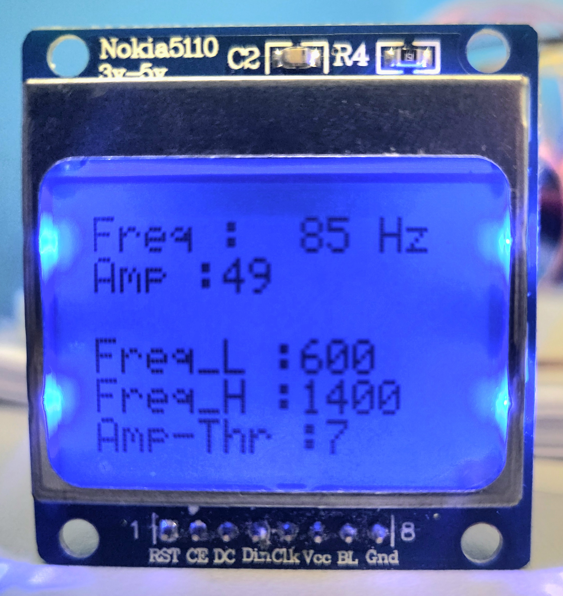

# EE447 — Audio Frequency Based Stepper Motor Driver  
## Real-Time Audio Processing and Motor Control using TM4C123G (ARM Cortex-M4)

This repository contains the implementation of a **real-time audio frequency detection and stepper motor control system** using the TM4C123G microcontroller. The system samples audio input from a microphone, performs frequency analysis using FFT (CMSIS DSP library), and drives a stepper motor at a speed proportional to the detected frequency.

This project was developed as part of the EE447 Introduction to Microprocessors course at Middle East Technical University (METU).

---

## 📸 Hardware Setup

<p align="center">
  
</p>

---

## 📌 Project Overview

The system performs real-time audio processing and converts detected frequency information into physical motion.

Core functionality:

- Samples audio signal using ADC at 4000 Hz
- Performs 512-point FFT using ARM CMSIS DSP library
- Detects dominant frequency and amplitude
- Controls stepper motor speed based on frequency
- Displays frequency, amplitude, and thresholds on Nokia 5110 LCD
- Uses PWM to control RGB LED brightness based on amplitude
- Allows user control via buttons and potentiometer

---

## 🎯 System Features

### Audio Processing

- Real-time microphone sampling
- 12-bit ADC sampling at 4000 Hz
- 512-sample buffer
- FFT-based frequency detection

### Stepper Motor Control

- Speed proportional to detected frequency
- Direction controlled by onboard buttons
- Driven using hardware timers (GPTM interrupts)

### Visual Feedback

- Frequency display on Nokia 5110 LCD
- Amplitude display
- Threshold display
- RGB LED indicating frequency range
- LED brightness proportional to amplitude (PWM)

### User Control

- Potentiometer to set amplitude threshold
- Buttons to control motor direction
- LCD interface for real-time monitoring

---

## 🧠 System Architecture

<p align="center">
  
</p>

Major system components:

- TM4C123G Microcontroller (ARM Cortex-M4)
- MAX4466 Microphone Module
- Nokia 5110 LCD (SPI)
- 28BYJ-48 Stepper Motor + ULN2003 Driver
- Potentiometer
- Onboard RGB LED
- Push Buttons

---

## ⚙️ Hardware Components

| Component | Function |
|---------|----------|
| TM4C123G | Main microcontroller |
| MAX4466 Microphone | Audio input |
| Nokia 5110 LCD | Display interface |
| 28BYJ-48 Stepper Motor | Mechanical output |
| ULN2003 Driver | Motor driver |
| Potentiometer | Threshold control |
| RGB LED | Frequency range indicator |
| Push Buttons | Motor direction control |

---

## 🔊 Audio Sampling System

Audio is sampled using the ADC module in SysTick interrupt handler.

Key properties:

- Sampling frequency: 4000 Hz
- Buffer size: 512 samples
- Resolution: 12-bit ADC
- Sampling performed in ARM Assembly (as required)

### Audio Sampling Flow

```
SysTick Interrupt
    ↓
Read ADC value
    ↓
Store in buffer
    ↓
When buffer full → FFT
```

---

## 📊 Frequency Detection using FFT

The CMSIS DSP library is used to perform FFT on the sampled signal.

FFT properties:

- 512-point FFT
- Q15 fixed-point format
- Real input, complex output
- Dominant frequency detected from magnitude spectrum

Frequency calculation:

```
Frequency = (Index × Sampling Frequency) / FFT Size
```

---

## ⚙️ Stepper Motor Control

The motor speed is proportional to detected frequency.

Motor control is implemented using GPTM timer interrupts.

Features:

- Adjustable speed via timer reload value
- Clockwise and counterclockwise rotation
- Interrupt-driven stepping
- Minimum step interval: 5 ms

### Motor Control Flow

```
Frequency detected
    ↓
Convert frequency → timer interval
    ↓
Configure GPTM reload value
    ↓
Stepper motor rotates
```

---

## 💡 LED Feedback System

RGB LED indicates frequency range:

| Frequency Range | LED |
|----------------|-----|
| Low | Red |
| Medium | Green |
| High | Blue |

LED brightness is controlled using PWM based on signal amplitude.

---

## 🖥 LCD Interface (SPI)

The Nokia 5110 LCD displays:

- Current frequency
- Signal amplitude
- Threshold values
- System status

Communication is implemented using SPI protocol.

<p align="center">
  
</p>

---

## 🔄 Software Architecture

The system is interrupt-driven and consists of:

- SysTick interrupt → Audio sampling
- GPTM interrupt → Motor stepping
- Main loop → FFT processing and UI updates

---

## 🛠 Technologies Used

- TM4C123G Microcontroller
- ARM Cortex-M4 Architecture
- C Programming Language
- ARM Assembly Language
- CMSIS DSP Library
- SPI Communication
- ADC Module
- GPIO
- GPTM Timers
- PWM

---

## ⏱ Real-Time Operation

System operates fully in real time:

- Continuous audio sampling
- Periodic FFT computation
- Real-time motor control
- Real-time user interface updates

---

## 🎯 Learning Outcomes

This project provided hands-on experience in:

- Embedded systems design
- Real-time signal processing
- ARM Cortex-M programming
- Assembly and C integration
- FFT and frequency analysis
- Hardware interfacing
- SPI communication
- Motor control
- Interrupt-driven system design

---

## 📚 Course Information

Course: EE447 Introduction to Microprocessors  
Institution: Middle East Technical University (METU)  
Microcontroller: TM4C123G (ARM Cortex-M4)  

---

## 📄 License

This project is for educational and academic purposes.
